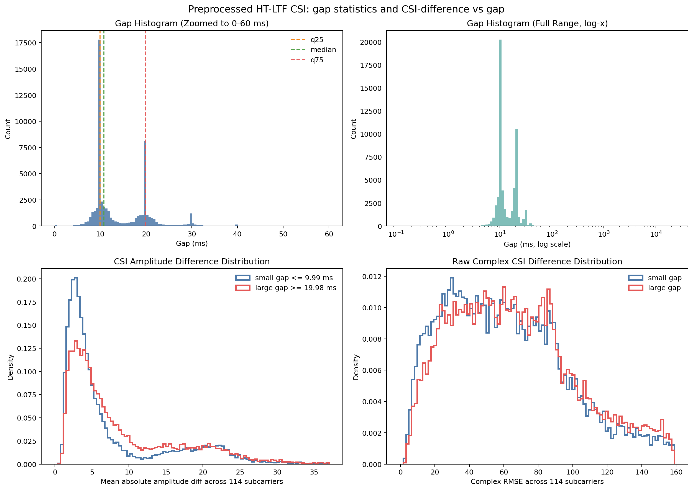
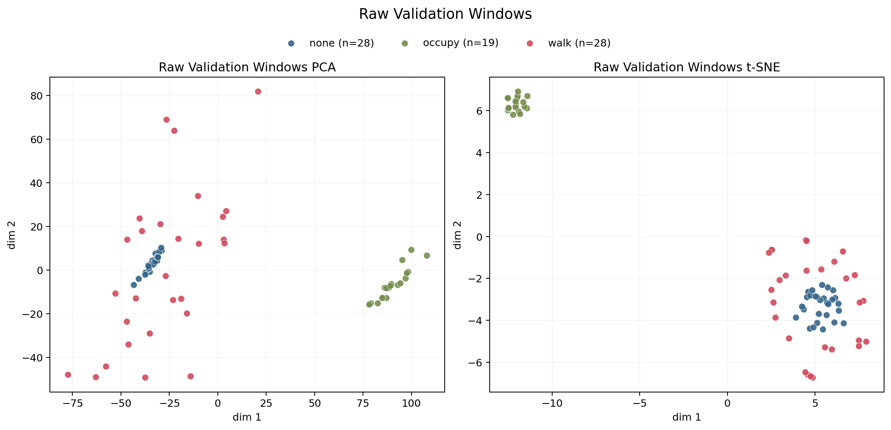
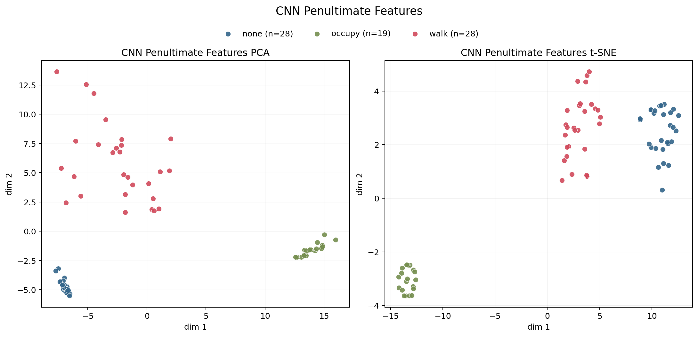
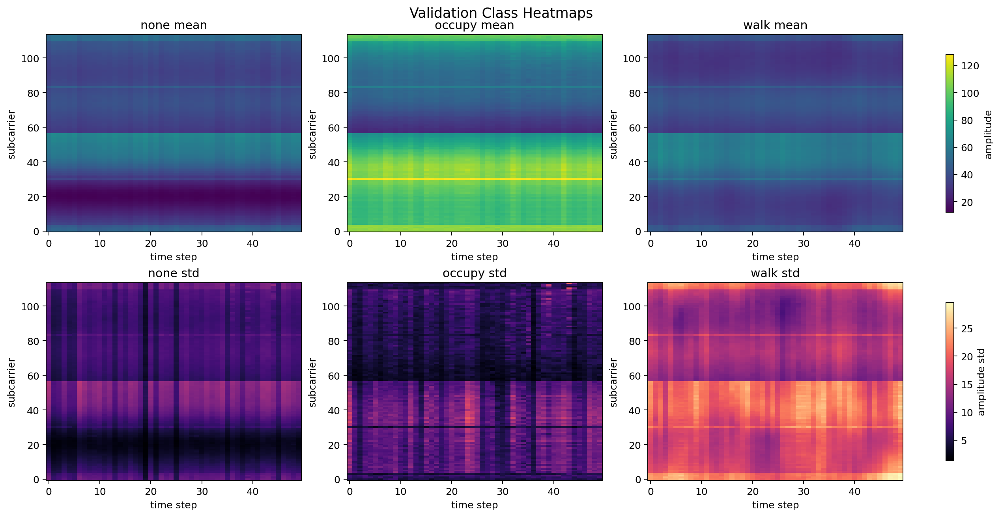
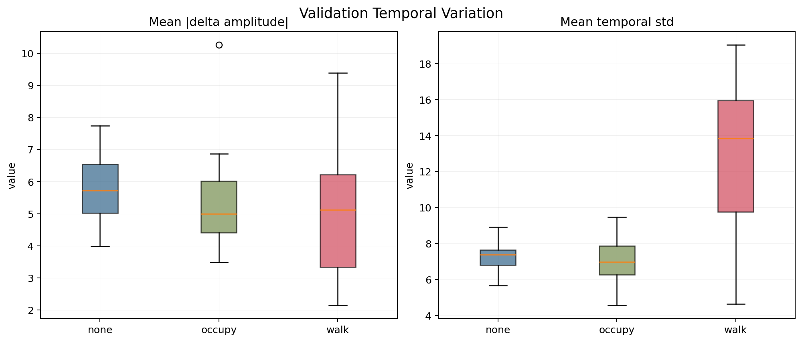
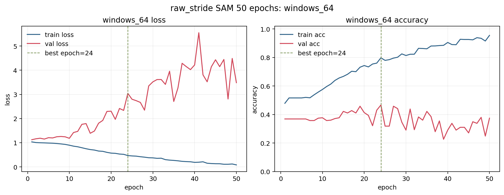
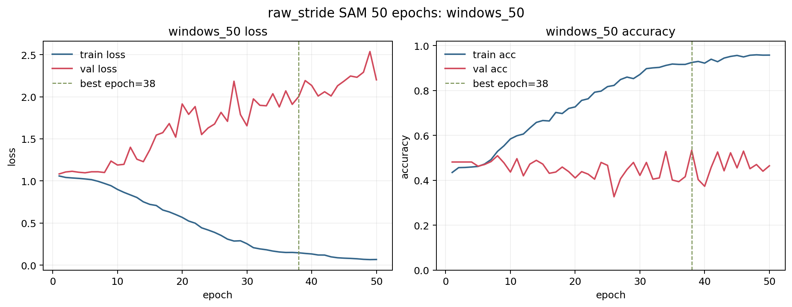

# FallDetection

Wi-Fi CSI(Channel State Information)를 이용해 사람의 상태와 동작을 분류하기 위한 전처리, 데이터셋 구성, 학습, 시각화 실험을 정리한 프로젝트입니다. 이 저장소는 단순 코드 모음이 아니라, 실제로 수행한 실험 결과와 그 해석을 함께 담은 재현 가능한 실험 기록을 목표로 합니다.

원본 데이터셋은 저장소에 포함하지 않았습니다. 대신 다음은 포함되어 있습니다.

- 전처리 스크립트와 학습 코드
- gap 분석 결과
- 시각화 결과
- 학습 로그와 체크포인트 요약

저장소에서 제외된 항목은 다음과 같습니다.

- `dataset/`: 원본 및 전처리 데이터셋
- `paper/`: 논문 파일
- `자료집/`: 참고 자료 모음
- 로컬 가상환경 디렉터리

---

## 1. 프로젝트 목표

이 프로젝트에서는 두 가지 분류 문제를 다루었습니다.

1. `none / occupy / walk`
   - `none`: 송수신기 사이에 아무것도 없는 상태
   - `occupy`: 사람이 송수신기 사이에 정적으로 존재하는 상태
   - `walk`: 사람이 송수신기 사이에서 걷는 상태

2. `large / normal / small`
   - stride 조건이 다른 별도 수집 데이터셋
   - 같은 전처리 철학을 적용하되, 더 어려운 분류 문제로 다룸

핵심 질문은 다음과 같습니다.

- row 단위 CSI만으로도 클래스 구분이 가능한가?
- 시계열 구조를 복원하면 `walk` 같은 동적 클래스 구분이 더 자연스러워지는가?
- 동일한 1D CNN baseline에서도 데이터셋 구성 방식에 따라 문제가 얼마나 쉬워지거나 어려워지는가?
- `Adam`과 `SAM`은 어려운 데이터셋에서 어떤 차이를 보이는가?

---

## 2. 원본 CSI 해석과 HT-LTF 기반 전처리

### 2.1 원본 CSV 한 행의 의미

원본 CSV는 패킷 수신 시점마다 계산된 CSI 로그이며, 한 행은 패킷 1개에 대한 CSI 관측치입니다. 중요한 필드는 다음과 같습니다.

- `local_timestamp`: 패킷 수신 시각
- `len`: CSI 버퍼 길이
- `data`: 실제 CSI 버퍼

이 프로젝트의 데이터는 `len=384`인 행이 대부분이며, 이는 다음처럼 해석했습니다.

- `384 ints = 192 complex`
- 버퍼 구조: `LLTF 64 complex + HT-LTF 128 complex`
- 각 complex는 `imag, real` 순으로 저장

### 2.2 왜 HT-LTF만 사용했는가

이 프로젝트에서는 **HT-LTF 기반 CSI만 사용**했습니다.

이유는 다음과 같습니다.

- 분류에 사용할 주된 채널 응답을 HT(802.11n) 기준으로 통일하고 싶었음
- raw buffer 안의 0 구간은 실제 측정 실패가 아니라 `null / guard / DC subcarrier`인 경우가 많았음
- 따라서 값 자체가 아니라 **고정 인덱스 마스크**로 유효 subcarrier만 남기는 것이 타당했음

적용한 마스크는 HT-LTF 내부의 유효 subcarrier만 남기도록 구성했습니다.

- 원본 `192 complex` 중 HT-LTF 구간: `complex index 64 ~ 191`
- 이 중 유지한 유효 구간: `66 ~ 122`, `134 ~ 190`
- 최종 결과: `114 complex = 228 ints`

즉 전처리 후 한 행은 `228`차원 벡터가 되며, 원본 한 행과 전처리 후 한 행이 1:1 대응되도록 유지했습니다.

관련 코드:

- [`scripts/preprocess_raw_htltf.py`](scripts/preprocess_raw_htltf.py)

---

## 3. Row-Level 데이터셋 분석

### 3.1 `none / occupy / walk` 데이터셋의 gap 특성

`local_timestamp` 기준 연속 행 간 gap을 계산하면, 완전히 균일한 시계열은 아니지만 대체로 `10 ms` 근처를 중심으로 분포함을 확인할 수 있었습니다.

주요 통계:

- 전체 gap 평균: `16.05 ms`
- 전체 gap 표준편차: `191.90 ms`
- 중앙값: `10.85 ms`
- `p90`: `21.27 ms`
- `p99`: `33.53 ms`
- 상위 1% outlier 제거 후 평균: `14.17 ms`
- 상위 1% outlier 제거 후 표준편차: `5.96 ms`

또한 gap이 짧은 경우와 긴 경우의 CSI 차이를 비교했을 때,

- 작은 gap 그룹 평균 amplitude diff: `7.76`
- 큰 gap 그룹 평균 amplitude diff: `9.27`

로, gap이 길수록 인접 CSI가 더 달라지는 경향을 확인했습니다.



관련 산출물:

- [`analysis/preprocessed_gap_csi_summary.json`](analysis/preprocessed_gap_csi_summary.json)
- [`analysis/preprocessed_gap_csi_analysis.png`](analysis/preprocessed_gap_csi_analysis.png)

### 3.2 Row-level baseline: 3-layer MLP

전처리된 한 행(`228`차원)을 그대로 입력으로 사용하는 가장 단순한 baseline도 먼저 실험했습니다.

모델:

- 입력: `228`
- hidden: `256 -> 128`
- 출력: `3 class`
- optimizer: `Adam`
- split: row random split `8:2`
- epoch: `50`

결과:

- validation accuracy: `0.9990`

혼동행렬:

| True \\ Pred | none | occupy | walk |
| --- | ---: | ---: | ---: |
| none | 2421 | 0 | 2 |
| occupy | 0 | 2764 | 5 |
| walk | 2 | 2 | 6094 |

관련 산출물:

- [`artifacts/mlp_row_split_50ep/training_summary.json`](artifacts/mlp_row_split_50ep/training_summary.json)
- [`scripts/train_row_mlp.py`](scripts/train_row_mlp.py)

이 결과는 row 단위 정보만으로도 클래스 구분 신호가 매우 강하다는 것을 보여주지만, 동일 파일 내 매우 유사한 row가 train/validation에 함께 들어갈 수 있으므로 엄격한 일반화 성능으로 해석하긴 어렵습니다.

---

## 4. 시계열 데이터셋 구성

`walk` 클래스는 시간축 변화가 중요하기 때문에, row-level 표현만으로는 충분하지 않을 수 있습니다. 따라서 CSI를 제한적으로 재구성하여 **10 ms 기준 균일 시계열**로 변환하는 전처리를 추가했습니다.

### 4.1 왜 단순 보간을 그대로 쓰지 않았는가

CSI는 금 가격처럼 부드러운 스칼라 시계열이 아니라,

- 패킷이 들어왔을 때만 관측되는 event-driven signal이고
- 복소수 채널 응답이며
- raw phase에는 packet-level offset이 섞일 수 있습니다.

따라서 임의 길이의 큰 gap을 cubic interpolation 등으로 메우는 것은 위험합니다. 대신 다음과 같이 매우 제한된 규칙만 사용했습니다.

### 4.2 적용한 시계열 전처리 규칙

1. HT-LTF 기반 전처리 후 amplitude만 사용
2. `10 ms` grid를 기준 시간축으로 사용
3. `20 ms`, `30 ms` gap에 해당하는 경우만 linear interpolation 허용
4. 그보다 큰 gap은 새로운 segment로 분리
5. 보간 여부를 표시하는 `interp_mask`를 함께 저장

관련 코드:

- [`scripts/build_resampled_sequence_dataset.py`](scripts/build_resampled_sequence_dataset.py)

### 4.3 `none / occupy / walk` 시계열 데이터셋

기본 시계열 데이터셋 생성 설정:

- `grid_us = 10000`
- `grid_tolerance_us = 2500`
- `max_interp_gap_steps = 3`
- feature = `114 amplitude + interp_mask`

생성 결과:

| Class | Source files | Resampled steps | Interpolated steps | Windows 64 | Windows 50 |
| --- | ---: | ---: | ---: | ---: | ---: |
| none | 18 | 16,394 | 4,278 | 1,041 | 1,944 |
| occupy | 24 | 19,606 | 5,762 | 442 | 1,012 |
| walk | 53 | 41,030 | 10,540 | 994 | 2,258 |

이후 visualization 전용 데이터셋으로는 중복을 줄이기 위해 `stride=20`, `window=50` 버전도 별도로 만들었습니다.

| Class | Windows 50 (`stride=20`) |
| --- | ---: |
| none | 145 |
| occupy | 88 |
| walk | 179 |

위 수치는 로컬에서 생성한 시계열 데이터셋 요약 파일을 바탕으로 정리한 값이며, 원본/전처리 데이터셋은 저장소에서 제외되어 있으므로 별도 데이터 준비 후 동일 스크립트로 재생성할 수 있습니다.

### 4.4 `large / normal / small` 시계열 데이터셋

`raw_stride` 데이터셋은 동일한 10 ms 기반 구조를 가지지만 jitter가 더 커서 tolerance를 넓혔습니다.

gap 분석 결과:

- 전체 중앙값: `15.57 ms`
- `p90`: `24.72 ms`
- `p99`: `42.05 ms`
- `10/20/30 ms` 근처 gap 비율 합: 약 `80.5%`
- tolerance를 `±4 ms`로 넓히면 설명 비율: 약 `91.7%`

따라서 이 데이터셋에서는 다음 설정을 사용했습니다.

- `grid_us = 10000`
- `grid_tolerance_us = 4000`
- `max_interp_gap_steps = 3`

생성 결과:

| Class | Source files | Resampled steps | Interpolated steps | Windows 64 | Windows 50 |
| --- | ---: | ---: | ---: | ---: | ---: |
| large | 19 | 16,506 | 5,742 | 1,766 | 2,742 |
| normal | 21 | 15,128 | 5,040 | 730 | 1,384 |
| small | 21 | 17,054 | 5,743 | 1,027 | 1,860 |

관련 분석 요약:

- [`analysis/preprocessed_raw_stride_gap_summary.json`](analysis/preprocessed_raw_stride_gap_summary.json)

시계열 데이터셋 수치는 로컬 생성 결과를 README에 직접 정리했으며, 저장소에 포함되지 않은 데이터셋에서 재생성 가능합니다.

---

## 5. `none / occupy / walk` 시계열 학습과 시각화

### 5.1 1D CNN baseline

시계열 baseline은 다음 구조를 사용했습니다.

- 입력: `(T, 114 amplitude + 1 mask)`
- model: `Conv1d(115→64, k=5) -> ReLU -> Conv1d(64→128, k=3) -> ReLU -> Global Average Pooling -> Linear(3)`
- optimizer: `Adam`
- split: `time_file`
  - 클래스별 파일을 시간순으로 정렬
  - 앞 `80%` 파일은 train
  - 뒤 `20%` 파일은 validation
- device: 가능하면 `MPS`

관련 코드:

- [`scripts/train_sequence_cnn_torch.py`](scripts/train_sequence_cnn_torch.py)

### 5.2 학습 결과

#### `windows_64`

- train windows: `1,914`
- validation windows: `563`
- best validation accuracy: `1.0000`

혼동행렬:

| True \\ Pred | none | occupy | walk |
| --- | ---: | ---: | ---: |
| none | 234 | 0 | 0 |
| occupy | 0 | 129 | 0 |
| walk | 0 | 0 | 200 |

관련 산출물:

- [`artifacts/sequence_cnn_torch_windows64_time_mps_seed42/training_summary.json`](artifacts/sequence_cnn_torch_windows64_time_mps_seed42/training_summary.json)

#### `windows_50`

- train windows: `4,192`
- validation windows: `1,022`
- best validation accuracy: `1.0000`

혼동행렬:

| True \\ Pred | none | occupy | walk |
| --- | ---: | ---: | ---: |
| none | 412 | 0 | 0 |
| occupy | 0 | 218 | 0 |
| walk | 0 | 0 | 392 |

관련 산출물:

- [`artifacts/sequence_cnn_torch_windows50_time_mps_seed42/training_summary.json`](artifacts/sequence_cnn_torch_windows50_time_mps_seed42/training_summary.json)

이 문제에서는 시계열 표현과 시간순 파일 분할 기준에서도 분리가 매우 강하게 나타났습니다.

### 5.3 시각화로 본 클래스 분리

`stride=20`, `window=50` validation set을 기준으로 시각화를 수행했습니다. 이때 사용한 checkpoint 역시 `time_file split`에서 validation accuracy `1.0000`을 기록한 모델입니다.

#### Raw embedding



#### CNN feature embedding



#### 클래스 평균/표준편차 heatmap



#### 시간 변화량 비교



관찰 결과:

- raw feature만으로도 `none / occupy / walk`가 비교적 잘 분리됨
- CNN의 penultimate feature 공간에서는 세 클래스가 더 명확하게 갈림
- `walk`는 평균 amplitude보다 **시간축 분산**이 더 큰 패턴을 보임

validation set 기준 temporal summary:

| Class | Mean abs delta | Mean temporal std |
| --- | ---: | ---: |
| none | 5.69 | 7.27 |
| occupy | 5.34 | 6.82 |
| walk | 5.04 | 12.97 |

즉 `walk`는 step 간 순간 차이보다, window 전체에서 더 넓고 불안정한 temporal structure로 구분되는 경향이 있었습니다.

관련 산출물:

- [`analysis/sequence_stride20_windows50_visuals/summary.json`](analysis/sequence_stride20_windows50_visuals/summary.json)
- [`scripts/visualize_sequence_class_separation.py`](scripts/visualize_sequence_class_separation.py)

---

## 6. `large / normal / small` 데이터셋: 더 어려운 문제

동일한 1D CNN을 `raw_stride` 기반 시계열 데이터셋에 적용하면 상황이 크게 달라졌습니다.

### 6.1 Adam baseline

#### `windows_64`, Adam 20 epoch

- best validation accuracy: `0.4078`
- macro F1: `0.3433`

혼동행렬:

| True \\ Pred | large | normal | small |
| --- | ---: | ---: | ---: |
| large | 98 | 6 | 28 |
| normal | 28 | 8 | 10 |
| small | 121 | 19 | 40 |

#### `windows_50`, Adam 20 epoch

- best validation accuracy: `0.4422`
- macro F1: `0.4141`

혼동행렬:

| True \\ Pred | large | normal | small |
| --- | ---: | ---: | ---: |
| large | 138 | 81 | 39 |
| normal | 40 | 42 | 52 |
| small | 68 | 19 | 57 |

해석:

- `windows_50`가 `windows_64`보다 낫지만, 전체적으로는 과적합이 강했음
- 특히 `normal` 클래스가 가장 어려웠음
- train accuracy는 높아지는데 validation accuracy가 개선되지 않는 전형적 과적합 패턴이 관찰됨

### 6.2 SAM 적용

동일한 1D CNN에 `SAM + SGD`를 적용했습니다.

설정:

- optimizer: `SAM`
- base optimizer: `SGD`
- learning rate: `0.01`
- `rho = 0.05`
- momentum: `0.9`

관련 코드:

- [`scripts/sam_torch.py`](scripts/sam_torch.py)

### 6.3 Adam vs SAM 비교

| Dataset | Optimizer | Epochs | Best epoch | Best val acc | Macro F1 |
| --- | --- | ---: | ---: | ---: | ---: |
| windows_64 | Adam | 20 | 18 | 0.4078 | 0.3433 |
| windows_64 | SAM | 20 | 19 | 0.4581 | 0.3726 |
| windows_64 | SAM | 50 | 24 | 0.4665 | 0.3834 |
| windows_50 | Adam | 20 | 2 | 0.4422 | 0.4141 |
| windows_50 | SAM | 20 | 8 | 0.5093 | 0.4352 |
| windows_50 | SAM | 50 | 38 | 0.5336 | 0.4564 |

핵심 해석:

- 두 데이터셋 모두 **최고 성능 기준으로는 SAM이 Adam보다 좋았음**
- 특히 `windows_50`에서 개선 폭이 컸음
- `SAM 20 epoch`는 아직 충분히 수렴하지 않았고, `50 epoch`까지 늘렸을 때 성능이 더 상승했음
- 최종적으로는 `windows_50 + SAM`이 가장 좋은 조합이었음

관련 요약:

- [`analysis/raw_stride_sam50_comparison.json`](analysis/raw_stride_sam50_comparison.json)

### 6.4 수렴성과 과적합 시각화

#### `windows_64`, SAM 50 epoch



#### `windows_50`, SAM 50 epoch



관찰 결과:

- `windows_64`: 최고 성능은 `epoch 24`에서 관측
- `windows_50`: 최고 성능은 `epoch 38`에서 관측
- 두 경우 모두 최종적으로는 다시 과적합이 나타남
- 그러나 `Adam`보다 `SAM`이 더 늦게 과적합하고, validation accuracy 기준 최고점도 더 높았음

---

## 7. 주요 결론

1. `none / occupy / walk` 데이터셋은 HT-LTF 기반 row feature만으로도 매우 강한 분리 신호를 가짐
2. 제한적 interpolation을 사용한 시계열화는 `walk`의 temporal structure를 설명하는 데 유용했음
3. `none / occupy / walk` 문제는 1D CNN baseline에서 사실상 완전 분리됨
4. 반면 `large / normal / small` 문제는 같은 모델에서도 훨씬 어려웠고, 단순 Adam baseline은 강한 과적합을 보였음
5. 어려운 데이터셋에서는 `SAM`이 더 안정적인 일반화를 제공했으며, 특히 `windows_50` 설정에서 가장 좋은 결과를 냈음

---

## 8. 재현에 사용한 주요 스크립트

- HT-LTF 추출: [`scripts/preprocess_raw_htltf.py`](scripts/preprocess_raw_htltf.py)
- 시계열 데이터셋 생성: [`scripts/build_resampled_sequence_dataset.py`](scripts/build_resampled_sequence_dataset.py)
- row-level MLP 학습: [`scripts/train_row_mlp.py`](scripts/train_row_mlp.py)
- NumPy 1D CNN baseline: [`scripts/train_sequence_cnn.py`](scripts/train_sequence_cnn.py)
- PyTorch 1D CNN baseline: [`scripts/train_sequence_cnn_torch.py`](scripts/train_sequence_cnn_torch.py)
- SAM optimizer:
  - NumPy row MLP용 [`scripts/sam_optimizer.py`](scripts/sam_optimizer.py)
  - PyTorch sequence CNN용 [`scripts/sam_torch.py`](scripts/sam_torch.py)
- 시각화: [`scripts/visualize_sequence_class_separation.py`](scripts/visualize_sequence_class_separation.py)

---

## 9. 실행 메모

이 저장소는 데이터셋 자체를 포함하지 않으므로, 동일한 실험을 재현하려면 로컬에 동일한 디렉터리 구조의 데이터셋을 준비해야 합니다.

대표 실행 흐름은 다음과 같습니다.

```bash
python scripts/preprocess_raw_htltf.py \
  --source-root /path/to/raw \
  --dest-root /path/to/preprocessed_raw

python scripts/build_resampled_sequence_dataset.py \
  --dataset-root /path/to/preprocessed_raw \
  --output-root /path/to/sequence_10ms_amp_mask \
  --grid-us 10000 \
  --grid-tolerance-us 2500 \
  --max-interp-gap-steps 3 \
  --window-lengths 64 50 \
  --window-stride 1

python scripts/train_sequence_cnn_torch.py \
  --windows-root /path/to/windows_50 \
  --split-mode time_file \
  --device mps \
  --epochs 20 \
  --batch-size 64 \
  --seed 42
```

`raw_stride` 계열은 `grid_tolerance_us=4000`으로 조정해 사용했습니다.
